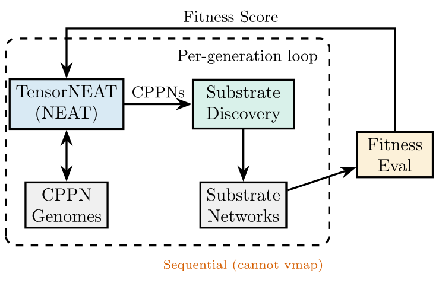
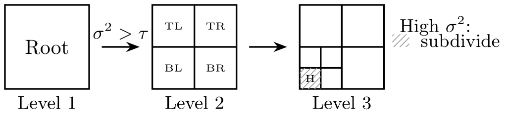
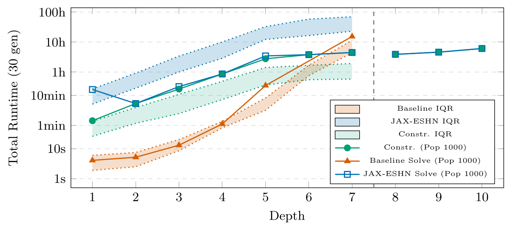
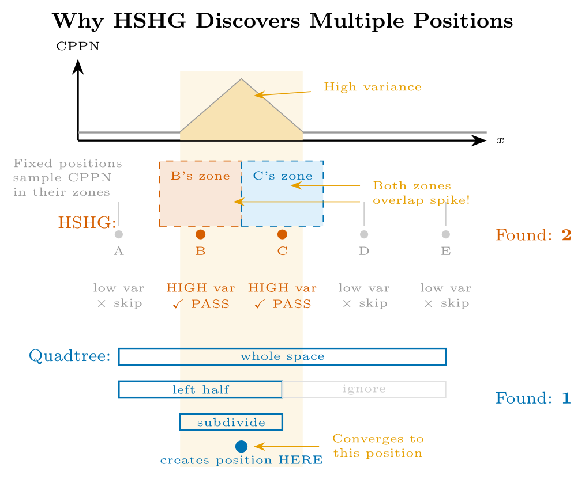

# JAX-ESHN

**A JAX/TensorNEAT implementation of ES-HyperNEAT, built to diagnose the quadtree
substrate-discovery bottleneck, not to fix it.**

ES-HyperNEAT discovers where to place neurons by recursively subdividing space with an
**adaptive quadtree** driven by CPPN-output variance. Each CPPN in a population therefore
produces a *different, variable-cardinality* set of substrate positions. This repository
packages a JAX/GPU implementation (**JAX-ESHN**) and uses it to show that this adaptivity
is structurally incompatible with population-level `vmap`/XLA batching: the very mechanism
that lets each genome self-organize a sparse, problem-tailored substrate is what breaks the
uniform-shape assumption GPU batching relies on. Batching within a CPPN plateaus near
~1.7×; replacing the quadtree with a precomputed hash grid (HSHG) fails by
order-of-magnitude over-discovery.

[](papers/es-hyperneat-quadtree-problem/figures/architecture.pdf)

*The per-generation loop (the paper's Fig. 1). TensorNEAT evolves CPPN genomes and scores fitness in batch; substrate discovery in between runs sequentially, once per CPPN, because every CPPN yields a different topology. The dashed box is the bottleneck this repository measures.*

[](papers/es-hyperneat-quadtree-problem/figures/quadtree.pdf)

*The mechanism under diagnosis (Fig. 2): a cell subdivides only where CPPN-output variance exceeds the threshold, so each genome grows its own sparse, variable-size substrate.*

It is the standing **diagnostic companion** to
[EMR-HyperNEAT](https://github.com/RomainClaret/emr-hyperneat), which resolves the
bottleneck by evaluating a static multi-resolution grid eagerly with hierarchical,
parent-gated variance masking.

## Status

> **Research code, not production software.** This repository reproduces the findings of
> one paper (below) and packages the implementation it diagnoses. It is the negative-result
> half of a pair: it characterizes a structural ceiling that EMR-HyperNEAT then breaks.

## Key Features

**What the code can do:**

- Run **ES-HyperNEAT in JAX**: lazy-quadtree substrate discovery per evolved CPPN
  (variance-driven subdivision, band-threshold pruning, iteration levels) on TensorNEAT's NEAT
  engine, exposed as one class (`JAXESHyperNEAT`)
- Drive **three interchangeable implementations** from one CLI (`--impl jax-eshn | pureples |
  hshg`): the JAX implementation, the PUREPLES CPU baseline, and the HSHG precomputed-grid
  ablation
- Benchmark **five tasks** (XOR, Parity-3, circle, sine, CartPole) over depth × population ×
  seed sweeps with checkpoint/resume, writing per-seed result JSON
- Apply **four batched optimizations** (batched division and pruning queries, `vmap` substrate
  evaluation, precomputed coordinate offsets)
- **Reproduce every paper number offline**: stdlib-only verify gates recompute the tables from
  the committed raw data (97/97 and 46/46 PASS), plus analysis scripts and a standalone TikZ
  figure pipeline
- Extend to **your own task** via the Task interface, backed by a 175-test suite and
  act-validated CI

**What it explores:**

- Why the adaptive quadtree **resists population-level `vmap`/XLA batching**: each CPPN
  discovers a different, variable-cardinality substrate, so no uniform tensor shape exists
- The empirical **~1.7× ceiling** of within-CPPN batching once population-level vectorization
  is blocked
- **XOR depth × population scaling** (D1-D7, exploratory D8-D10): construction overhead growth,
  the JIT compilation plateau, and the Baseline's solve-rate collapse against JAX-ESHN's
  first-generation solves at depth
- Whether a **precomputed spatial hash grid (HSHG)** can replace the quadtree: it over-discovers
  positions by an order of magnitude and solves nothing
- A **CPU-vs-CPU multi-benchmark control** (Parity-3, circle, sine, CartPole) isolating the
  implementation effect from the hardware, plus a compile-vs-eval isolation of where JAX-ESHN's
  time goes

## Documentation

New here? The [`docs/`](docs/) folder is the full guide:

- **[Installation](docs/installation.md)**: submodules, optional extras, platform notes, troubleshooting
- **[Architecture](docs/architecture.md)**: the layer this repository adds, the module map, a component diagram
- **[Running & writing experiments](docs/writing-your-own-experiment.md)**: the driver CLI, the Python API, the Task interface, and how to add your own task
- **[Reproducing the paper](docs/reproducing-the-paper.md)**: frozen-data verification and live re-runs
- **[Testing](docs/testing.md)**: the test tiers and validating the CI workflows with `act`

At a glance, the driver picks one of three implementations by `--impl`; the JAX-ESHN runner drives
the top-layer class, which reaches the external TensorNEAT engine through a small shim:

```text
   tasks/ (Task + Problem) ───────────────┐
                                          ▼
   driver.py  ──select_runner(--impl)──▶  one of three runners
      │
      ├─ jax-eshn  → run_jax_eshn.py  → ★ eshyperneat.py (the top layer: lazy-quadtree
      │                                   substrate discovery) → _compat shim → tensorneat
      ├─ pureples → baseline/pureples_harness.py → third_party/pureples
      └─ hshg     → hshg/run_hshg.py  → hshg/ core + experiments → tensorneat

   ★ = the lazy-quadtree ES-HyperNEAT layer this work diagnoses (pureples/hshg are the baseline/ablation; TensorNEAT is the external CPPN/NEAT engine).
```

## Installation

JAX-ESHN builds on pinned forks of [TensorNEAT](https://github.com/RomainClaret/tensorneat)
(the CPPN/NEAT engine) and [PUREPLES](https://github.com/RomainClaret/pureples) (the CPU
baseline), included as git submodules.

```bash
git clone --recursive https://github.com/RomainClaret/jax-es-hyperneat.git
cd jax-es-hyperneat

# (if you forgot --recursive)
git submodule update --init --recursive

pip install -e .                       # the jax_es_hyperneat package
pip install -e third_party/tensorneat  # the pinned TensorNEAT fork (required)
pip install -e third_party/pureples    # the PUREPLES CPU baseline (optional; for --impl pureples)
```

Requires **Python ≥ 3.10** and **JAX** `>=0.5,<0.12` (CI pins `0.6.1`). Optional extras:

```bash
pip install -e ".[dev]"        # pytest, to run the test suite
pip install -e ".[analysis]"   # scipy, for the paper analysis scripts
pip install -e ".[baseline]"   # gymnasium + neat-python, to re-run CartPole / PUREPLES from scratch
```

See **[docs/installation.md](docs/installation.md)** for platform notes and troubleshooting.

For quiet CPU-only runs on macOS:

```bash
export JAX_PLATFORMS=cpu TF_CPP_MIN_LOG_LEVEL=3
```

> The submodule URLs use HTTPS, so `git clone --recursive` works anonymously (and in CI). If
> you prefer SSH for pushing to the forks, add a one-time rewrite:
> `git config --global url."git@github.com:".insteadOf "https://github.com/"`.

## Quick start

```python
from jax_es_hyperneat import JAXESHyperNEAT
from jax_es_hyperneat.tasks import TASKS

task = TASKS["xor"]                       # static: xor | parity3 | circle | sine  (cartpole uses the gym loop, see docs)
algo = JAXESHyperNEAT()
problem = task.make_problem()
cfg = task.build_config(algo, depth=2, population_size=150)
state = algo.initialize(cfg, problem, seed=42)
state, metrics = algo.run_generation(state, problem)
print(float(metrics.best_fitness))
```

Or use the unified benchmark driver (JAX-ESHN, the PUREPLES baseline, and the HSHG
ablation, over all five tasks, with checkpoint/resume):

```bash
python -m jax_es_hyperneat.driver --task xor  --impl jax-eshn --depths 2 --pop 150 --gens 60 --seeds 42-44
python -m jax_es_hyperneat.driver --task sine --impl pureples --depths 2 --seeds 0-29
python -m jax_es_hyperneat.driver --task xor  --impl hshg     --depths 2 --pop 50 --gens 50 --seeds 0-29
```

`pureples` and `hshg` additionally need `pip install -e ".[baseline]"` (neat-python + gymnasium);
`pureples` also needs its submodule installed (`pip install -e third_party/pureples`).
See **[docs/installation.md](docs/installation.md)**.

Full CLI reference, the Python API, and how to add your own task:
**[docs/writing-your-own-experiment.md](docs/writing-your-own-experiment.md)**.

## Testing

```bash
pip install -e ".[dev]"
JAX_PLATFORMS=cpu pytest jax_es_hyperneat/tests -m "not slow"   # fast suite (164 tests; CI gate, includes the isolation guard)
JAX_PLATFORMS=cpu pytest jax_es_hyperneat/tests                 # full suite (175 tests; the extra 11 evolve live)
JAX_PLATFORMS=cpu python jax_es_hyperneat/tests/test_smoke.py   # quick smoke only
```

The tiers, the `[baseline]`-skip behavior, and validating the CI workflows with `act`:
**[docs/testing.md](docs/testing.md)**.

## The paper

[`papers/es-hyperneat-quadtree-problem/`](papers/es-hyperneat-quadtree-problem/) holds the
committed result data, the figures, and the analysis/verify scripts behind the paper, with a
[reproduction guide](papers/es-hyperneat-quadtree-problem/REPRODUCIBILITY.md). The manuscript
itself lives with the arXiv submission, not here.

| Paper | Type | Diagnoses | Publication |
|-------|------|-----------|-------------|
| [`es-hyperneat-quadtree-problem`](papers/es-hyperneat-quadtree-problem/README.md) | Preprint / technical report | the quadtree's `vmap`-vectorization bottleneck across five benchmarks | [paper](https://claret.tech/pdf/claret2026quadtree) |

> Companion to **EMR-HyperNEAT** (GECCO 2026, [10.1145/3795101.3805361](https://doi.org/10.1145/3795101.3805361)),
> which resolves the bottleneck characterized here.

[](papers/es-hyperneat-quadtree-problem/figures/baseline_iqr.pdf)

*The headline scaling result (Fig. 4): XOR total runtime vs depth, log scale. Bands are IQRs (Baseline CPU orange; JAX-ESHN projected 30-generation total blue; construction overhead alone green); marked lines are Pop 1000. Construction overhead comes to dominate the JAX-ESHN total as depth grows; D8-D10 come from a separate Pop-1000 campaign.*

[](papers/es-hyperneat-quadtree-problem/figures/mechanism.pdf)

*Why the obvious fix fails (Fig. 3): replacing the adaptive quadtree with a precomputed spatial hash grid (HSHG) discovers a position for every fixed zone that overlaps a variance spike, an order of magnitude more than the quadtree's convergent search, and solves nothing (0% across all conditions).*

### Reproducing the paper

To reproduce the paper's tables and figures from the committed result data (no GPU, no
evolution):

```bash
cd papers/es-hyperneat-quadtree-problem
python scripts/runners/verify_results.py         # PASS/FAIL the multi-benchmark tables vs results/*.json
python scripts/runners/verify_scaling_tables.py  # PASS/FAIL the XOR scaling tables vs benchmark_checkpoints/
python scripts/analysis/analyze_results.py       # multi-benchmark statistics + LaTeX
python scripts/analysis/analyze_hshg_results.py  # the HSHG over-discovery / 0%-solve result
```

Walkthrough (frozen-data verification, live re-runs, and cost caveats):
**[docs/reproducing-the-paper.md](docs/reproducing-the-paper.md)**.

### Result data

This repository **commits its raw result data
in-repo** (`papers/es-hyperneat-quadtree-problem/results/`, ~2.4 MB, plus the XOR scaling
`benchmark_checkpoints/`). The same data is archived on Zenodo,
[10.5281/zenodo.21761118](https://doi.org/10.5281/zenodo.21761118);
[`scripts/fetch_results.py`](scripts/fetch_results.py) is an optional
checksum-verifier / restore tool, not a required download.

## Repository layout

```
jax_es_hyperneat/        installable package (public API: JAXESHyperNEAT)
  eshyperneat.py         the lazy-quadtree ES-HyperNEAT implementation (the paper's JAX-ESHN)
  tasks/                 standalone task definitions (xor, parity3, circle, sine, cartpole)
  baseline/              PUREPLES CPU baseline harness
  hshg/                  the HSHG precomputed-grid ablation
  driver.py              unified benchmark CLI (jax-eshn | pureples | hshg)
  _compat/               internal compatibility shim (lets the package run standalone)
third_party/tensorneat   pinned TensorNEAT fork (git submodule)
third_party/pureples     pinned PUREPLES baseline (git submodule)
docs/                    user guides (install · architecture · experiments · reproduction · testing)
papers/                  the paper: source + committed data + analysis/verify scripts
scripts/fetch_results.py optional Zenodo data mirror/verifier
```

## Community & Support

Questions, ideas, and experiences with the code are welcome on
[GitHub Discussions](https://github.com/RomainClaret/jax-es-hyperneat/discussions); bug reports
and reproduction problems belong on
[GitHub Issues](https://github.com/RomainClaret/jax-es-hyperneat/issues).

## License

Code is GPL-3.0-or-later, as below. The result data is licensed separately under
**CC-BY-4.0** — both the copies committed here under
`papers/es-hyperneat-quadtree-problem/{results,benchmark_checkpoints}/` and the Zenodo
archive ([10.5281/zenodo.21761118](https://doi.org/10.5281/zenodo.21761118)).

Copyright (C) 2026 Romain Claret

This program is free software: you can redistribute it and/or modify it under the terms of
the GNU General Public License as published by the Free Software Foundation, either version
3 of the License, or (at your option) any later version. See [LICENSE](LICENSE).

This program is distributed in the hope that it will be useful, but WITHOUT ANY WARRANTY;
without even the implied warranty of MERCHANTABILITY or FITNESS FOR A PARTICULAR PURPOSE.
See the GNU General Public License for more details.

## Citation

If you use this repository, please cite the paper it reproduces. If you build on the method
it diagnoses or its resolution, please also cite the companion EMR-HyperNEAT paper.

**This paper (the diagnosis):**

```bibtex
@misc{claret2026quadtree,
  title={On Scaling Coordinate-Based Neuroevolution: The Quadtree Bottleneck in ES-HyperNEAT},
  author={Claret, Romain and O'Neill, Michael and Cotofrei, Paul and Stoffel, Kilian},
  year={2026},
  note={Preprint / technical report},
  howpublished={\url{https://claret.tech/pdf/claret2026quadtree}}
}
```

**The companion (the resolution):**

```bibtex
@inproceedings{claret2026emr,
  title={Tensor-Accelerated Eager Multi-Resolution Grids for Evolving Large-Scale Substrates},
  author={Claret, Romain and O'Neill, Michael and Cotofrei, Paul and Stoffel, Kilian},
  booktitle={Proceedings of the Genetic and Evolutionary Computation Conference (GECCO)},
  year={2026},
  publisher={ACM},
  doi={10.1145/3795101.3805361}
}
```

## Acknowledgements

- **ES-HyperNEAT** is the algorithm of
  [Risi and Stanley (2012)](https://doi.org/10.1162/artl_a_00071); this repository implements
  it in JAX and diagnoses its quadtree bottleneck.
- **[PUREPLES](https://github.com/ukuleleplayer/pureples)** by Westh and Krabbe Munck is the
  reference pure-Python ES-HyperNEAT implementation that inspired this one; it also serves as
  the CPU baseline (`third_party/pureples`).
- **[TensorNEAT](https://doi.org/10.1145/3730406)** by Wang et al. is the GPU-accelerated NEAT
  library JAX-ESHN builds on (`third_party/tensorneat`).
