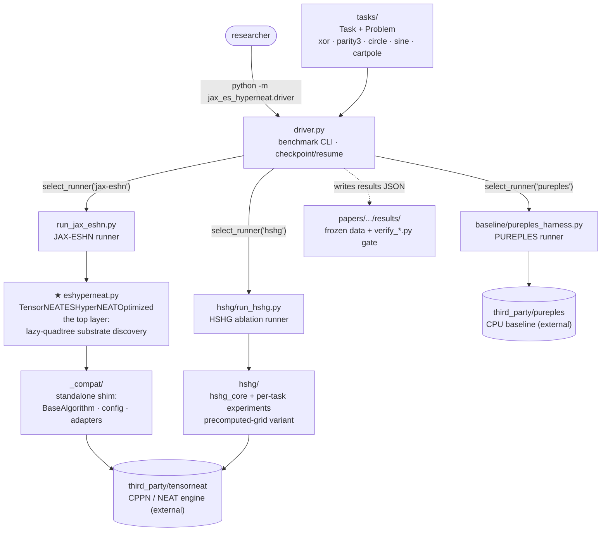

# Architecture

This page explains the layer this repository adds, the high-level component diagram, and what
each module does. It does **not** document how TensorNEAT works internally. TensorNEAT is the
external CPPN/NEAT engine underneath, and you use it through the thin layer described here.

## What this code is

ES-HyperNEAT places neurons by recursively subdividing 2D space with an **adaptive quadtree**
driven by CPPN-output variance. `jax_es_hyperneat` is a JAX/TensorNEAT implementation of that
algorithm, **JAX-ESHN**, built to measure why the adaptive quadtree resists GPU batching. The
top layer this repository adds is one class, `TensorNEATESHyperNEATOptimized` (in `eshyperneat.py`), plus the
runners, tasks, and CLI that drive it. Everything below that class is the unmodified TensorNEAT
engine, reached through a small compatibility shim (and some direct TensorNEAT imports).

## Component diagram

If your viewer does not render Mermaid, read it top to bottom: the **driver** picks one of three
**runners** by `--impl`; the JAX-ESHN runner drives the **top-layer class**, which talks to
TensorNEAT through the **`_compat`** shim; the **tasks** feed every runner; results are written as
JSON that the paper's verify scripts check.

## The top layer: `TensorNEATESHyperNEATOptimized`

One class in `jax_es_hyperneat/eshyperneat.py`, exported as the public name `JAXESHyperNEAT`. It
wraps TensorNEAT's CPPN/NEAT engine and adds the ES-HyperNEAT substrate-discovery loop on top:

- **Substrate discovery (the lazy quadtree).** *Lazy*: built per genome on demand, as opposed to
  EMR-HyperNEAT's eager whole-grid evaluation. For each evolved CPPN it subdivides space where the
  CPPN's output **variance** exceeds `division_threshold`, then keeps connections that survive a
  **band-detection** test (`band_threshold`), so each genome grows its own sparse, variable-size
  set of neuron positions. This per-genome, variable-cardinality structure is exactly what the
  paper shows is incompatible with population-level `vmap`/XLA batching.
- **Substrate build + forward pass.** Discovered nodes and connections are assembled into a
  network (`_build_tensorneat_substrate`) and evaluated (`_forward_hyperneat_style`: `tanh` hidden,
  `sigmoid` output).
- **Generation loop.** The usual ask → discover → build → evaluate → tell cycle, exposed as
  `initialize(config, problem, seed)` and `run_generation(state, problem)` (with an
  `ask`/`transform`/`tell` path used by the gym loop).
- **Batched optimizations.** A series of batched-query / caching / precomputed-offset optimizations
  layered onto the loop (labeled `O1`, `O2`, … in the source); the paper measures their
  speedup ceiling (~1.7×). You do not need to understand them to use the class; they are internal.

You normally do not call the discovery internals directly. You interact through `initialize` /
`run_generation` (see [writing-your-own-experiment.md](writing-your-own-experiment.md)) or the
`run_single` harness.

## Module map

| Path | What it does | How you use it |
|------|--------------|----------------|
| `jax_es_hyperneat/eshyperneat.py` | The top layer: `TensorNEATESHyperNEATOptimized` (lazy-quadtree ES-HyperNEAT). | `from jax_es_hyperneat import JAXESHyperNEAT`. |
| `jax_es_hyperneat/driver.py` | Unified benchmark CLI; dispatches to a runner by `--impl`, writes JSON, checkpoints/resumes. | `python -m jax_es_hyperneat.driver ...` |
| `jax_es_hyperneat/run_jax_eshn.py` | Single-run harness for JAX-ESHN: `run_single(task, depth, seed, config)` → `RunResult`; `summarize()`. | Call directly for one experiment, or via the driver. |
| `jax_es_hyperneat/tasks/` | Task + Problem definitions (xor, parity3, circle, sine, cartpole), shared `ES_PARAMS`, `DEPTH_POSITIONS`. | `from jax_es_hyperneat.tasks import TASKS`. Add your own here. |
| `jax_es_hyperneat/baseline/` | PUREPLES CPU baseline harness (the comparison the paper diagnoses against). | `--impl pureples`; needs the `[baseline]` extra. |
| `jax_es_hyperneat/hshg/` | The HSHG precomputed-grid ablation (the failed alternative): `hshg_core` primitives + per-task experiments. | `--impl hshg`. |
| `jax_es_hyperneat/gpu_metrics.py` | Optional NVIDIA utilization/VRAM sampling for run metadata (no-op without a GPU). | Automatic; nothing to call. |
| `jax_es_hyperneat/_compat/` | Internal compatibility shim: `BaseAlgorithm`, config manager, TensorNEAT adapters (the plumbing that lets the package run standalone against TensorNEAT). | You don't import it directly. |
| `jax_es_hyperneat/tests/` | The test suite (175 tests). | See [testing.md](testing.md). |
| `papers/es-hyperneat-quadtree-problem/` | The paper: LaTeX source, committed result data, and verify/analysis scripts. | See [reproducing-the-paper.md](reproducing-the-paper.md). |
| `third_party/tensorneat` | Pinned TensorNEAT fork, the external CPPN/NEAT engine. Required. | Installed once; not documented here. |
| `third_party/pureples` | Pinned PUREPLES fork, the external CPU baseline. Optional. | Needed only for `--impl pureples`. |

## Data flow

1. A `Task` (from `tasks/`) supplies substrate coordinates, a fitness threshold, and a `Problem`
   with `get_data()`.
2. `driver.py` reads `--impl` and `select_runner` returns one of the three `run_single` functions
   (all share the signature `run_single(task, depth, seed, config, verbose=True)`).
3. For `jax-eshn`, the runner builds the top-layer algorithm via `task.build_config(...)` and
   `algo.initialize(...)`, then evolves to `max_generations`.
4. Results are written to `<out>/<prefix>_<task>_results.json` (`prefix` = `jax_eshn` / `pureples`
   / `hshg`); the paper's `verify_*.py` scripts later re-check the committed copies.

## Where to next

- Install: [installation.md](installation.md)
- Run experiments / build your own: [writing-your-own-experiment.md](writing-your-own-experiment.md)
- Reproduce the paper: [reproducing-the-paper.md](reproducing-the-paper.md)
- Run the tests: [testing.md](testing.md)
